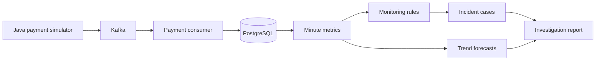

# SentinelPay

SentinelPay monitors simulated payment traffic, detects changes in system behavior, and brings related alerts together for investigation. It follows payments from a Java simulator through Kafka into PostgreSQL, then uses minute-level metrics to identify high failure rates, slow processing, and drops in volume.

I built it as a follow-up to my Transaction Anomaly Detection Engine. That project focused on individual transactions; SentinelPay looks at how the payment system behaves over time.

## What it does

- Generates normal, degraded, and outage traffic with repeatable simulation settings.
- Streams payments through Kafka and stores events and metrics in PostgreSQL.
- Handles duplicate delivery, malformed messages, and database recovery.
- Detects changes in failure rate, average latency, and transaction volume.
- Projects short-term trends and flags possible threshold crossings.
- Groups related findings into incident cases with evidence and suggested investigation steps.
- Supports optional Ollama explanations, with a built-in report available without a model.
- Answers questions about a selected incident using its findings and recent observations.

The backend and local demos are working. The React dashboard and an initial deployment on free hosting are next. AWS is planned for October; a free host has not been selected yet.

## Try the demo

The React dashboard is being added in Part 5. Run `npm install` and `npm run dev`
from the repository root for the local UI. It opens with an explicitly labeled
saved demo; the Java pipeline remains a separate process.

You'll need **JDK 21** on your PATH. The Maven wrapper downloads Maven and project dependencies on first use. The local launchers use PowerShell and have been tested on Windows.

From the repository root:

```powershell
cd backend
.\scripts\start-part4.ps1
```

The demo starts on **port 8082** with its own temporary Kafka and PostgreSQL data. It sends five minutes of rising payment failures and latency, followed by a spike, through the pipeline. These are historical synthetic samples, so you don't have to wait six minutes.

The terminal prints two URLs:

- **Historical forecast:** a projection using the five minutes before the spike.
- **Incident report:** the spike's findings, supporting evidence, and investigation steps.

Open those URLs in your browser to see the JSON responses. Leave the terminal open while exploring; press **Enter** to stop the demo. Each launch starts with fresh data and leaves the persistent pipeline data alone.

See the [incident demo guide](docs/part-4-demo.md) for expected results and optional model setup.

## How it works



Each payment contains an ID, timestamp, amount, currency, status, and latency. Amounts use `BigDecimal`; metrics are grouped by UTC minute and currency.

The consumer inserts the payment and updates its metrics in one database transaction. Replaying an identical payment ID does not increase the totals. Kafka offsets are acknowledged after storage succeeds. Malformed messages go to a dead-letter topic, while database failures remain retryable.

Monitoring runs every 30 seconds. It evaluates completed minutes after a ten-second grace period and rechecks the latest 30 minutes so late payments can correct earlier findings. Related rules for the same minute and currency share a persistent incident case.

### Detection rules

| Signal | Warning | Critical |
| --- | --- | --- |
| Failure rate | At least 20% | At least 50% |
| Average latency | At least 1,000 ms | At least 2,000 ms |
| Transaction volume | At most 50% of the recent median | At most 20% of the recent median |

Failure and latency checks require at least 20 payments in a minute. Volume checks need five qualifying minutes within the preceding ten minutes, each with at least 20 payments. Missing history is reported as insufficient data.

### Forecasts and investigation

A linear regression over five consecutive minutes projects failure rate and average latency three minutes ahead. The response includes the projected value, slope, and historical fit. These are simple trend estimates; they have not been calibrated against real payment incidents.

Investigation reports keep observed facts separate from possible causes. They show the rule evidence, forecasts, and checks that could help explain the result. A case can clear when late data changes its underlying metrics, while retaining its ID and first detection time.

Ollama support is optional and disabled by default. Model suggestions are returned separately from the evidence and cannot change metrics or case state. The adapter's HTTP behavior and fallback paths are tested; live model quality has not been evaluated. Setup details are in the [Part 4 guide](docs/part-4-demo.md#optional-ai-narration).

You can also ask about a specific case: why it was flagged, what changed before it,
or what to investigate next. Each request uses that case's evidence and recent
observations. Without a model, supported questions receive a rule-based answer;
other questions return the evidence report with an explanation of the limitation.
Questions are independent, with no saved chat history. The dashboard control is
still to be built.

## Stack

| Area | Tools |
| --- | --- |
| Backend | Java 21, Spring Boot 4.1.1, Maven |
| Streaming | Spring Kafka |
| Storage | PostgreSQL, Spring JDBC, HikariCP, Flyway |
| Testing | JUnit, Mockito, real local Kafka and PostgreSQL |
| Optional explanations | Ollama through its HTTP API |

The development launchers start Kafka and PostgreSQL through test dependencies. You don't need Docker or a separate database installation to run them.

## Other ways to run it

All commands below run from `backend/`.

### Persistent local pipeline

```powershell
.\scripts\start-part2.ps1
```

This starts the full backend on **port 8081**, including monitoring and incident reports. The script keeps its original name from the streaming implementation. Data survives restarts under `backend/.local/`.

In another terminal, publish a sample and inspect its metrics:

```powershell
Invoke-RestMethod -Method Post 'http://localhost:8081/api/pipeline/simulations?count=100&scenario=DEGRADED&seed=42'
Invoke-RestMethod 'http://localhost:8081/api/pipeline/metrics' | ConvertTo-Json -Depth 5
```

Publishing acknowledges Kafka delivery; storage completes asynchronously. Monitoring results appear after the payment minute closes and a scan runs. Press Enter in the launcher terminal to stop the services.

### Standalone backend

```powershell
.\mvnw.cmd spring-boot:run
```

This runs the simulator preview on **port 8080** without Kafka or PostgreSQL:

```powershell
Invoke-RestMethod 'http://localhost:8080/api/simulator/transactions?count=5&scenario=DEGRADED&seed=42' | ConvertTo-Json -Depth 5
```

Preview events are not stored. Stop the server with Ctrl+C.

### Console simulator

```powershell
.\mvnw.cmd compile
java -cp target/classes com.sentinelpay.backend.simulator.PaymentSimulatorDemo --count=20 --scenario=DEGRADED --seed=42
```

With no arguments, the simulator prints ten transactions and exits. Use `--help` for options, including a delay between events.

| Scenario | Success probability | Simulated latency |
| --- | --- | --- |
| `NORMAL` | 90% | 10–500 ms |
| `DEGRADED` | 70% | 300–2,000 ms |
| `OUTAGE` | 10% | 1,000–5,000 ms |

All scenarios generate USD amounts from $0.01 to $500.00. A seed repeats the generated amounts, statuses, and latencies; IDs and timestamps remain fresh.

## API overview

The pipeline, monitoring, and intelligence endpoints are available on the full local pipeline or isolated demo.

| Method | Endpoint | Purpose |
| --- | --- | --- |
| POST | `/api/pipeline/simulations` | Generate and publish a batch |
| GET | `/api/pipeline/transactions` | List stored payments |
| GET | `/api/pipeline/transactions/{id}` | Look up a payment |
| GET | `/api/pipeline/metrics` | Read minute-level metrics |
| POST | `/api/monitoring/runs` | Run monitoring manually |
| GET | `/api/monitoring/status` | Check the latest scan status |
| GET | `/api/monitoring/findings` | Read rule findings |
| GET | `/api/intelligence/forecasts` | Read short-term trend projections |
| GET | `/api/intelligence/incidents` | List incident cases |
| GET | `/api/intelligence/incidents/{id}` | Read an investigation report |
| POST | `/api/intelligence/incidents/{id}/explanation` | Request an optional model explanation |
| POST | `/api/intelligence/incidents/{id}/questions` | Ask about one incident; JSON body with `question` (1–500 characters) |

The demo guides cover query parameters, limits, and response examples.

## Tests

```powershell
.\scripts\verify-part4.ps1
```

This runs the full test suite and packages the application. Tests cover simulation, event validation, duplicate delivery, database recovery, metric aggregation, detection rules, forecasts, incident corrections, questions, and the AI adapter.

Integration tests use real Kafka and PostgreSQL with isolated data and random ports. They also check that stored history and corrected incident cases survive a restart. Live model calls are disabled during tests.

For a single test class:

```powershell
.\mvnw.cmd '-Dtest=TrendForecasterTest' test
```

In Eclipse, import `backend/` as an existing Maven project with JDK 21. Refresh with F5 after external changes, then run test classes with **Run As → JUnit Test**.

## Project layout

```text
backend/
  src/main/java/com/sentinelpay/backend/
    transaction/    Payment event model
    simulator/      Traffic generation and preview API
    pipeline/       Kafka delivery, storage, and metrics
    monitoring/     Detection rules and scheduled scans
    incident/       Forecasts, cases, and investigation reports
  src/main/resources/db/migration/
  src/test/java/com/sentinelpay/backend/
  scripts/          Local launchers and verification scripts
docs/               Demo walkthroughs and implementation details
```

## Roadmap

| Part | Focus | Status |
| --- | --- | --- |
| 1 | Transaction model and payment simulator | Implemented |
| 2 | Kafka streaming and PostgreSQL metrics | Implemented |
| 3 | Monitoring and anomaly detection | Implemented |
| 4 | Trend forecasts and incident investigation | Implemented; live AI evaluation remains open |
| 5 | React dashboard with incident questions, observability, Docker, and initial free hosting | Planned |

AWS deployment follows in October. Hosting and model-provider limits will be
checked before choosing the free setup; local Ollama support does not imply that
a free web host can run a model.

The current system is for local development. It has no authentication or rate limiting. Detection thresholds are demo settings, complete feed silence needs a separate check, and corrections older than the 30-minute scan window need a backfill feature. Multi-minute incident grouping, automatic retention, and TimescaleDB support are also still open.

## Guides

- [Simulator and backend basics](docs/part-1-demo.md)
- [Kafka pipeline and storage](docs/part-2-demo.md)
- [Monitoring rules and findings](docs/part-3-demo.md)
- [Forecasts and incident investigation](docs/part-4-demo.md)
