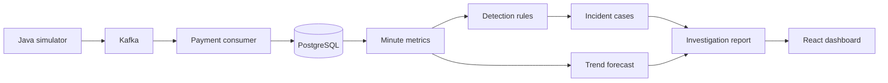
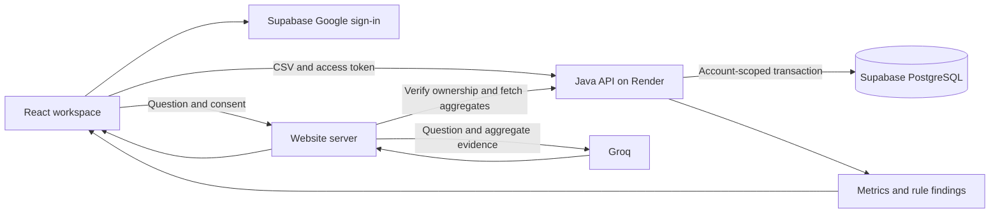

# SentinelPay

A Java-first payment monitoring project with a working web app for private CSV uploads, metric analysis, and AI-assisted investigation.

I built SentinelPay as a follow-up to my Transaction Anomaly Detection Engine. That project focused on unusual individual transactions. SentinelPay looks at the system around them: are more payments failing, is processing getting slower, and has traffic dropped?

Most of the backend work is in Java. React makes the results easier to explore, and AI helps explain the evidence. The app does not process payments, move money, or claim to identify confirmed root causes.

**[Open SentinelPay](https://sentinelpay-monitor.w61983961.chatgpt.site/)**

## Try it

You can explore **Overview**, **Transactions**, and **Incidents** without an account. These views show saved synthetic results from the Java pipeline. The incident page offers live Groq explanations and saved backend answers.

For your own workspace:

1. Open **My uploads** and sign in with Google.
2. Download the sample CSV, or choose a file using the format below.
3. Select **Upload and analyze**.
4. Review the chart, failure rate, latency, and checks by minute.
5. To ask AI about the file, review the sharing notice, give consent, and submit a question.

The downloadable sample contains **180 payments**, including **23 failures**, across eight minutes. Its summary shows a **12.8% failure rate** and **644 ms average latency**. These describe the sample; they are not performance benchmarks.

Your saved files stay in your account. You can search by filename, reopen an analysis, or delete a file with confirmation. The login and workspace layouts adapt to smaller screens, and animations respect reduced-motion preferences.

## What runs where

The project has two paths that share Java metric and detection code.

| | Public web app | Local streaming demo |
| --- | --- | --- |
| Input | Private CSV uploads and a saved demo | Java-generated payment events |
| Backend | Java upload API on Render | Spring Boot with Kafka and PostgreSQL |
| Storage | Supabase PostgreSQL for private files | Local PostgreSQL for events and incidents |
| Accounts | Google through Supabase Auth | No authentication; local development only |
| AI | Groq through the website server | Optional Ollama adapter and rule-based reports |
| Analysis | Historical file metrics and threshold checks | Scheduled detection, forecasts, and incident cases |

The public overview is a saved demo, not a live payment feed. Private uploads are persisted, but uploading a file does not start continuous monitoring. Kafka runs locally. AWS deployment is future work.

## Features

### Payment pipeline

- Generate normal, degraded, and outage traffic with repeatable simulation settings.
- Send events through Kafka and save them in PostgreSQL.
- Insert a payment and update its metrics in the same database transaction.
- Avoid counting identical replayed events twice.
- Acknowledge Kafka offsets after storage succeeds.
- Route malformed messages to a dead-letter topic and keep database failures retryable.

### Monitoring and investigation

- Aggregate events by UTC minute and currency.
- Check failure rate, average latency, and drops in volume.
- Report insufficient data instead of calling an undersampled minute healthy.
- Project short-term trends with a simple linear regression.
- Group related findings for the same minute and currency into an incident case.
- Separate observed evidence, possible explanations, and suggested investigation steps.
- Recheck recent minutes so late events can correct findings and case state.

### Private workspace

- Google sign-in, saved history, filename search, and a downloadable sample.
- Validate CSVs before saving; a bad file does not leave partial transaction records.
- Enforce file ownership in both Java queries and PostgreSQL row-level security.
- Ask AI about a selected file only after consenting to share its aggregate evidence.
- Apply persistent request limits for uploads and private AI questions.
- Explain expired sessions, service failures, quotas, and uncertain upload outcomes.

## Architecture

### Local streaming path



Each payment has an ID, timestamp, amount, currency, outcome, and latency. Amounts use `BigDecimal`. Metrics stay grouped by currency rather than combining unrelated monetary values.

The local monitor runs every 30 seconds. It checks completed minutes after a ten-second grace period and revisits the most recent 30 minutes so late events can correct earlier results.

### Hosted upload path



Java validates the access token before using its account ID. File operations set that ID inside a database transaction, and the setting clears when the transaction ends. PostgreSQL policies restrict which file and transaction rows the runtime login can read or change. Java's ownership filters remain in place too.

This protects against accidentally missing an ownership filter. It does not protect against a compromised backend, which is still trusted to supply the authenticated identity. The runtime database login has limited privileges; migrations run separately. See [database isolation](docs/database-isolation.md) for the tests and rollout order.

## Detection and prediction

| Signal | Warning | Critical |
| --- | --- | --- |
| Failure rate | At least 20% | At least 50% |
| Average latency | At least 1,000 ms | At least 2,000 ms |
| Transaction volume | At most 50% of the recent median | At most 20% of the recent median |

Failure and latency checks require at least 20 payments in a minute. Volume checks need five qualifying minutes within the preceding ten minutes, each with at least 20 payments. Missing minutes are not assumed to mean zero traffic.

The streaming forecast uses five consecutive minutes to project failure rate and average latency three minutes ahead. It includes the slope and historical fit. This is a baseline forecasting method, not a trained incident-prediction model or an incident probability. The thresholds and forecast have not been validated against real production payment data.

## Where AI fits

The hosted app uses Groq to answer questions about a demo incident or a selected private upload. The website server loads the evidence itself; the browser cannot provide replacement findings. The provider key stays on the server.

For private files, Groq receives the question, currency, minute-level counts, failures, latencies, and rule findings. Transaction IDs, amounts, filenames, account details, and authentication tokens are excluded. Sharing requires consent in the question form. Do not enter confidential information in questions.

Answers must follow a JSON schema and cite rules from the supplied evidence. These checks validate structure and references, not every claim the model makes. Answers are labelled unverified and cannot modify stored data. SentinelPay does not save chat history.

Local Ollama support is optional and disabled by default. Its adapter and fallback behavior are tested, but model quality has not been evaluated. The hosted Groq integration is separate; the website does not host model weights. See the [AI guide](docs/hosted-ai.md).

## Stack

| Area | Tools |
| --- | --- |
| Backend | Java 21, Spring Boot 4.1.1, Maven |
| Streaming | Kafka, Spring Kafka |
| Database | PostgreSQL, Spring JDBC, HikariCP, Flyway |
| Frontend | React, Vite, plain CSS |
| Accounts | Supabase Auth with Google sign-in |
| AI | Groq for the hosted app; optional Ollama locally |
| Testing | JUnit, Mockito, Vitest, real local Kafka and PostgreSQL |
| Hosting | OpenAI Sites for the dashboard/server, Render for the Dockerized Java API, Supabase for private storage |

## Run locally

The PowerShell launchers have been tested on Windows. Install **JDK 21** and **Node.js 22.12 or newer**. The Maven wrapper downloads Maven and dependencies on first use.

### Dashboard with saved data

From the repository root:

```powershell
npm ci
npm run dev
```

Open `http://127.0.0.1:5173`. The saved demo works without Java. Hosted accounts and AI secrets are not automatically copied into your local environment.

### Full incident demo

In another terminal, from the repository root:

```powershell
cd backend
.\scripts\start-part4.ps1
```

This starts isolated Kafka and PostgreSQL services and the backend on **port 8082**. It sends a synthetic sequence of rising failures and latency followed by a spike. The samples are historical, so you do not need to wait for each minute to pass.

The terminal prints forecast and incident-report URLs. Choose **Live pipeline** in the local dashboard to use the running backend. Leave the terminal open and press **Enter** to stop. The launchers use test dependencies, so the local demo does not require Docker.

### Persistent pipeline

From `backend/`:

```powershell
.\scripts\start-part2.ps1
```

This starts the pipeline on **port 8081** and keeps its data under `backend/.local/`. The script keeps its original name but includes the later monitoring and incident features.

In another terminal:

```powershell
Invoke-RestMethod -Method Post 'http://localhost:8081/api/pipeline/simulations?count=100&scenario=DEGRADED&seed=42'
Invoke-RestMethod 'http://localhost:8081/api/pipeline/metrics' | ConvertTo-Json -Depth 5
```

Publishing acknowledges Kafka delivery. Storage and monitoring happen afterward, so refresh once the minute closes and a scan runs.

### Simulator only

From `backend/`:

```powershell
.\mvnw.cmd spring-boot:run
```

The preview runs on **port 8080** without Kafka or a database. Preview events are not stored.

```powershell
Invoke-RestMethod 'http://localhost:8080/api/simulator/transactions?count=5&scenario=DEGRADED&seed=42'
```

For the console version:

```powershell
.\mvnw.cmd compile
java -cp target/classes com.sentinelpay.backend.simulator.PaymentSimulatorDemo --count=20 --scenario=DEGRADED --seed=42
```

A seed repeats amounts, outcomes, and latencies; IDs and timestamps remain fresh. Use `--help` for the remaining options.

### Private upload backend

Private accounts require Supabase configuration and database setup. The `uploads` profile runs separately from Kafka. Follow the [private-account guide](docs/private-accounts.md) and [migration order](docs/database-isolation.md) rather than putting credentials in source files.

The local launcher is `scripts/start-uploads.ps1`, with **port 8083** as its default. The development proxy forwards upload requests there. Running Vite alone does not reproduce the hosted AI server integration.

## CSV format and limits

Use a UTF-8 CSV with this exact header:

```csv
id,timestamp,amount,currency,status,latencyMs
```

- IDs must be unique within the file.
- Timestamps must be ISO-8601 instants with a timezone, such as a UTC value ending in `Z`.
- Amounts must be positive, currencies valid, and latency nonnegative.
- Status must be `SUCCESS` or `FAILED`.
- Use synthetic or de-identified data. Do not upload card numbers, credentials, customer names, or confidential production records.

| Limit | Value |
| --- | --- |
| CSV size | 2 MiB |
| Transactions per file | 5,000 |
| Saved files per account | 20 |
| Upload attempts per account | 5 per minute, 50 per day |
| Private AI questions per account | 3 per minute, 20 per day |
| Shared private AI capacity | 12 per minute, 200 per day |
| Private AI time window | Up to 120 observed minutes per currency |
| Question length | 500 characters |

Private request limits are stored in PostgreSQL. The public demo AI endpoint has separate best-effort limits per server instance. Provider quotas also apply.

Upload requests have a 90-second timeout. A lost response does not prove the upload failed, so uploads and deletions are never retried automatically. Refresh saved files before repeating an uncertain operation. Duplicate-file prevention across separate upload requests is not implemented yet.

## API overview

| Method | Endpoint | Purpose |
| --- | --- | --- |
| GET | `/api/simulator/transactions` | Preview synthetic transactions |
| POST | `/api/pipeline/simulations` | Publish a simulated batch to Kafka |
| GET | `/api/pipeline/transactions` | Read stored pipeline payments |
| GET | `/api/pipeline/metrics` | Read minute metrics |
| POST | `/api/monitoring/runs` | Trigger a monitoring scan |
| GET | `/api/monitoring/findings` | Read rule findings |
| GET | `/api/intelligence/forecasts` | Read trend projections |
| GET | `/api/intelligence/incidents` | List incident cases |
| POST | `/api/intelligence/incidents/{id}/questions` | Ask the local incident backend a question |
| GET / POST | `/api/uploads` | List private files or upload a CSV |
| GET / DELETE | `/api/uploads/{id}` | Read an analysis or delete a private file |
| POST | `/api/uploads/{id}/questions` | Ask the hosted website server about a private file |

Simulator and pipeline routes belong to local modes. Private upload routes require authentication; the hosted upload API does not expose the simulator. Detailed examples are in the guides below.

## Tests

From the repository root:

```powershell
npm test
npm run build
node scripts/check-build.mjs
```

These check frontend data handling, sample generation, authentication helpers, AI request boundaries, response validation, and upload failure handling. The build check verifies that the generated website server serves its pages and assets. The frontend/server suite has **44 passing tests**.

For the backend, from `backend/`:

```powershell
.\mvnw.cmd test
```

Or test and package the application:

```powershell
.\scripts\verify-part4.ps1
```

For account-isolation checks alone:

```powershell
.\mvnw.cmd '-Dtest=PrivateUploadStoreTest,UploadApiTest' test
```

Backend tests cover validation, duplicate delivery, database recovery, aggregation, monitoring, forecasts, incident corrections, CSV imports, signed-token authentication, and ownership checks. Integration tests use real local Kafka and PostgreSQL with isolated data and ports. Model calls are mocked.

Row-security tests use a restricted database login and force pooled connection reuse. They check unfiltered reads, cross-account writes and deletes, and identity cleanup after commit and rollback. All **13 targeted storage/API tests** passed for that change, separately from the earlier full backend regression run.

Live browser checks covered two Google accounts, separate file lists, uploads, persistence after reload, deletion cancellation, file search, and a real AI explanation of the sample. These checks do not replace a security audit or load testing.

In Eclipse, import `backend/` as an existing Maven project with JDK 21. Refresh with **F5** after external changes, then use **Run As → JUnit Test** on a test class.

## Project layout

```text
backend/
  src/main/java/com/sentinelpay/backend/
    transaction/     Payment event model
    simulator/       Synthetic traffic and preview API
    pipeline/        Kafka ingestion, storage, and metrics
    monitoring/      Detection rules and scheduled scans
    incident/        Forecasts, cases, and investigation reports
    imports/         Private CSV uploads and account isolation
  src/main/resources/db/
    migration/       Streaming database migrations
    uploads/         Private workspace migrations
  src/test/          Unit and integration tests
  scripts/           Local demos and verification
  Dockerfile         Hosted Java API image
frontend/
  src/               React views, styling, and client helpers
  server/            Hosted AI endpoints and account configuration
scripts/             Build, configuration, and deployment helpers
docs/                Setup guides and implementation notes
render.yaml          Java hosting configuration
```

## Things I still want to improve

The core app works, but I would not call it a production payment-monitoring service yet.

- Add upload idempotency so retrying the same request cannot create another file.
- Test backup restoration and define retention and account-deletion workflows.
- Add staging, operational alerts, and broader load and security testing.
- Evaluate detection thresholds and AI answers against a larger, representative dataset.
- Handle complete feed silence and corrections outside the current monitoring window.
- Group incidents across multiple minutes rather than only one minute and currency.
- Deploy continuous ingestion separately from the saved dashboard demo.
- Explore TimescaleDB and AWS when there is a clear reason to add them.

Free hosting may sleep or reach quotas. Email/password registration and recovery emails are disabled until an email sender is configured; Google is the supported public signup route. The local streaming API has no authentication and should not be exposed publicly as-is.

## Further reading

- [Simulator and backend basics](docs/part-1-demo.md)
- [Kafka pipeline and storage](docs/part-2-demo.md)
- [Monitoring rules](docs/part-3-demo.md)
- [Forecasts and incident investigation](docs/part-4-demo.md)
- [Dashboard walkthrough](docs/part-5-dashboard.md)
- [Hosted AI](docs/hosted-ai.md)
- [Private accounts and uploads](docs/private-accounts.md)
- [Google sign-in setup](docs/google-sign-in.md)
- [CSV format and storage setup](docs/transaction-upload-format.md)
- [Database account isolation](docs/database-isolation.md)
